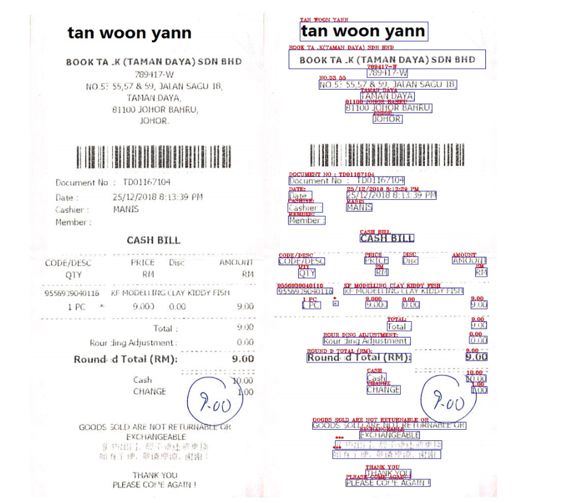

# ICDAR 2019 SROIE Dataset

This repository contains a cleaned version of the dataset for the [ICDAR 2019 Robust Reading Challenge on Scanned Receipts OCR and Information Extraction (SROIE)](https://rrc.cvc.uab.es/?ch=13&com=introduction).

## Dataset Link

* Official Challenge Page: [ICDAR 2019 SROIE](https://rrc.cvc.uab.es/?ch=13&com=introduction)

## Dataset Description

This dataset is designed for OCR (Optical Character Recognition) and Key Information Extraction tasks on scanned receipts.

* **Data Splits**: Includes `train` and `val` directories.
* **Annotation Format**: The annotations are provided in the format `x1,y1,x2,y2,x3,y3,x4,y4,transcription`.
* **Mapping**: Each text annotation file (in .txt format) shares the same base name as its respective receipt image.

## Sample Data Visualization

